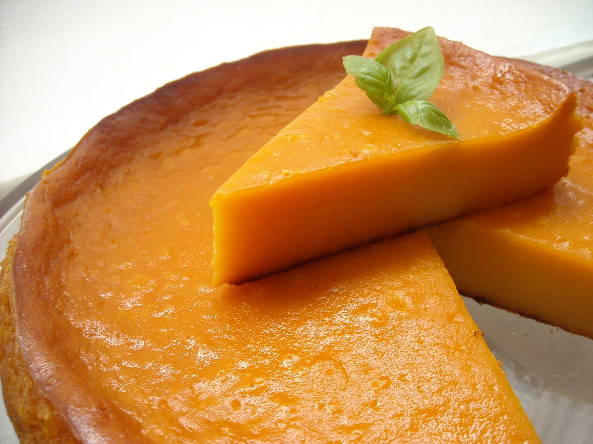

# Tarta de calabaza

## Ingredientes

- 1 kg de calabaza
- 4 huevos
- 1 lata de leche condensada
- 1 lata de aceite (utiliza la lata de leche condensada como medida)
- 1/2 lata de azúcar (utiliza la lata de leche condensada como medida)
- 1 lata de harina (utiliza la lata de leche condensada como medida)
- 1 sobre de polvo de hornear
- Canela al gusto
- Ralladura de limón

## Preparación

1. Cocer la calabaza junto con la canela hasta que esté tierna. Luego, retirar la canela y hacer un puré con la calabaza cocida.
   
2. En un bol grande, batir los huevos junto con la leche condensada, el aceite, el azúcar, la harina y el polvo de hornear hasta obtener una mezcla homogénea.

3. Agregar el puré de calabaza y la ralladura de limón a la mezcla y seguir batiendo hasta que todos los ingredientes estén bien incorporados.

4. Precalentar el horno a 180°C (350°F).

5. Verter la mezcla en un molde para tarta previamente engrasado y enharinado.

6. Hornear durante aproximadamente 1 hora, o hasta que al insertar un palillo en el centro, este salga limpio.

7. Retirar del horno y dejar enfriar antes de desmoldar y servir.

## Notas

> Esta tarta de calabaza es un postre tradicional con un sabor dulce y reconfortante, perfecto para disfrutar en cualquier época del año. La canela y la ralladura de limón agregan un toque aromático que realza el sabor de la calabaza. Asegúrate de cocinar bien la calabaza antes de hacer el puré para obtener una textura suave y cremosa en la tarta.