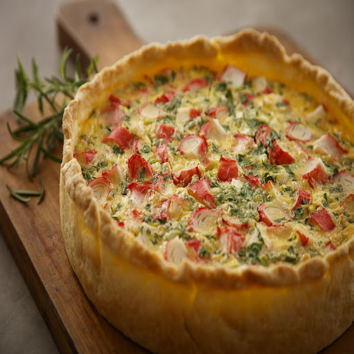

# Tarta de kanikama y puerros

## Ingredientes

- 1/2 kilo de puerros
- 12 palitos de kanikama cortados o 6 largos
- 1 tapa de masa para tarta (hojaldrada o criolla)
- 50 gramos de manteca
- 100 ml de crema de leche
- 80 gramos de queso rallado
- Sal y pimienta negra al gusto
- 3 huevos

## Preparación

1. Cortar los puerros en trozos pequeños. En una olla, derretir la manteca y rehogar los puerros hasta que estén suaves.
   
2. Agregar el kanikama cortado a la olla y rehogar por unos minutos junto con los puerros.
   
3. Incorporar la crema de leche, el queso rallado, una pizca de sal y pimienta negra al gusto. Mezclar bien y cocinar por unos minutos más hasta que todo esté integrado y ligeramente espeso.

4. En un bol aparte, batir ligeramente los huevos y añadirlos a la mezcla de puerros y kanikama. Mezclar bien para integrar.

5. Precalentar el horno a temperatura media.

6. Colocar la tapa de masa para tarta en un molde para tarta previamente engrasado y enharinado.

7. Verter la mezcla de puerros, kanikama y huevos sobre la masa para tarta.

8. Hornear la tarta en el horno precalentado hasta que la superficie comience a dorarse, aproximadamente unos 30-35 minutos.

9. Retirar del horno y dejar enfriar un poco antes de cortar y servir.

## Notas

> Esta tarta de kanikama y puerros es una opción deliciosa para disfrutar como plato principal o acompañamiento. Puedes servirla caliente o fría, según tu preferencia. El kanikama le aporta un sabor marino suave y el queso rallado añade un toque de cremosidad y sabor adicional. ¡Es perfecta para una comida ligera o como parte de un buffet!