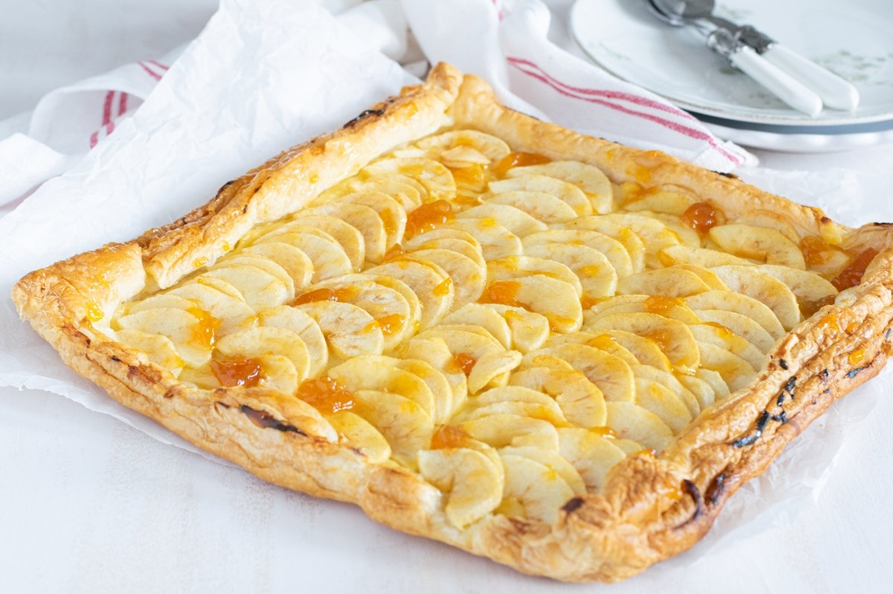

# Tarta de Manzana

## Ingredientes

- 150 gramos de margarina (Tulipán)
- 8 cucharadas soperas de azúcar
- 6 cucharadas soperas de leche
- 6 cucharadas soperas de harina
- 1 huevo
- 1/2 sobre de levadura tipo Royal (7.5 gramos)
- 1 kg de manzanas reinetas

## Preparación

1. Precalentar el horno a 180°C (350°F). Engrasar un molde para tarta con mantequilla.

2. En un bol grande, batir la margarina con el azúcar hasta obtener una mezcla cremosa.

3. Añadir la leche y la levadura (Royal) previamente mezclada con la harina. Mezclar bien hasta obtener una masa homogénea.

4. Pelar y cortar en rodajas finas 2 manzanas reinetas (las otras reservarlas).

5. Incorporar las manzanas peladas y cortadas en rodajas a la masa y mezclar suavemente.

6. Verter la masa en el molde preparado y alisar la superficie con una espátula.

7. Pelar y cortar en rodajas finas las manzanas restantes y colocarlas sobre la superficie de la tarta para decorar.

8. Hornear durante aproximadamente 40-45 minutos, o hasta que al insertar un palillo en el centro de la tarta, este salga limpio.

9. Retirar del horno y dejar enfriar en el molde durante 10 minutos antes de desmoldar y enfriar completamente sobre una rejilla.

10. Una vez fría, se puede cubrir la superficie con mermelada para darle brillo y sabor adicional.

## Notas

- Asegúrate de que todos los ingredientes estén a temperatura ambiente antes de comenzar la preparación.
- Puedes usar mermelada de albaricoque o melocotón para cubrir la tarta al final, según tu preferencia.
